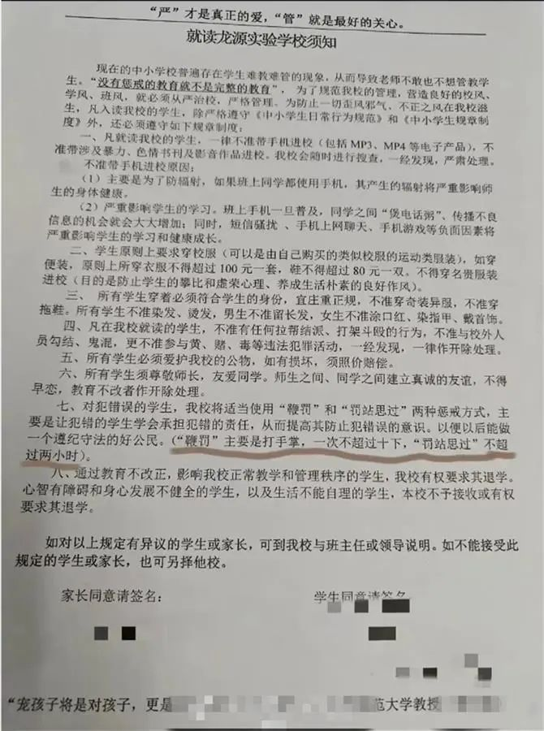

# 龙源实验学校鞭罚学生-不同意就转学
- 违反中华人民共和国现行法律法规，违规体罚学生
- 违反自愿性原则，强制家长接受学校体罚学生，否则就转学
- 过度干预学生身体自主权，区别对待，可能要求男生留寸头，待调查（条目7）。若仅要求不遮住眼睛，则暂不视作黑校规。
- 过度干预学生课外活动，针对禁止与校外人员勾结，是否包括新闻记者和自媒体人，待调查（条目4）。若实际执行中仅限制学生与校外人员打架斗殴，则暂不视作黑校规。
- 奇装异服+身上衣服不得超过100元一套，语义模糊，限制了学生选择权，冬天保暖衣物大概率超过100元，疑似有普遍违规的风险。不清楚衬衫是否属于奇装异服。
## 新闻事件图片

