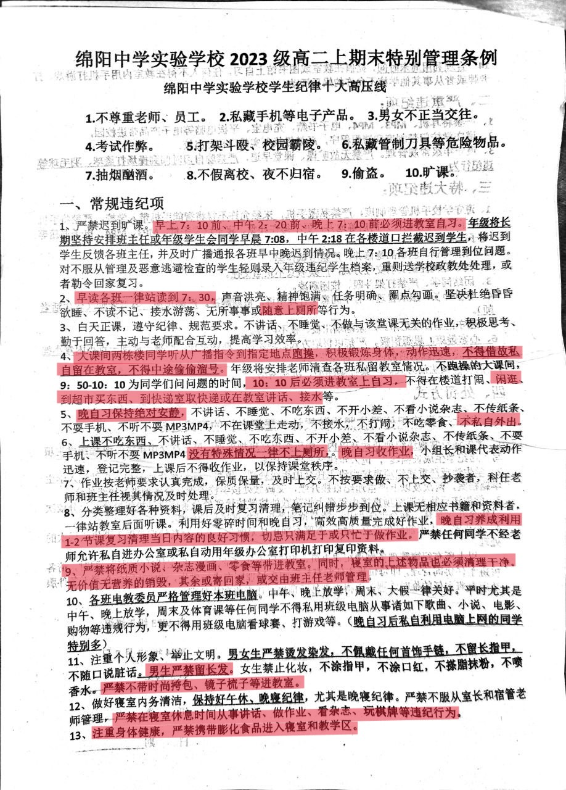
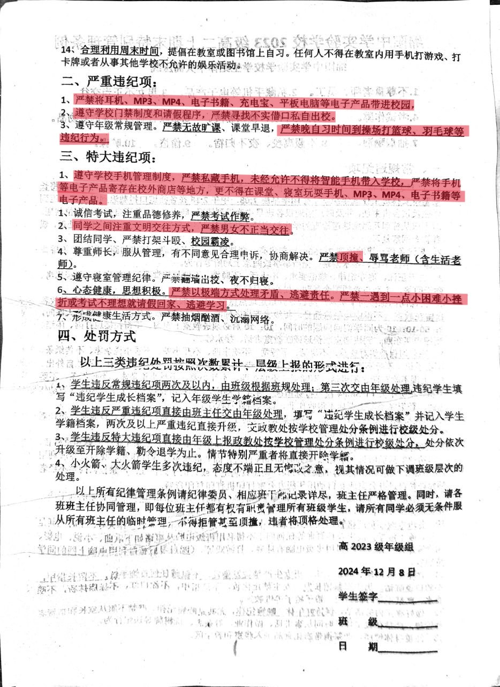

# 绵阳中学特别管理条例
该校规细则阶梯度不够，相同违规行为的处罚力度跨越三个级别，存在明显的擅断风险。
## 黑校规说明
\*为未定项。
- 违反自愿性原则的校规
    - 强制学生参加早晚自习和周末补课。条目1.1，1.2，1.5，1.6，1.8，2.2，2.3，3.6
    - 强制学生参加跑操。条目1.4
    - 过度干预学生课外活动。条目1.4，1.12*，2.3
    - 过度干预学生身体自主权。条目1.11
- 侵害学生合法权利的校规
    - 限制学生正常上厕所。条目1.2，1.6
    - 侵害学生隐私。条目1.9，1.11，1.13，2.1，3.1
- 容易造成类推解释的校规
    - 无价值、无营养定义模糊，容易被类推解释。条目1.9
    - 男女不正当交往定义模糊，容易被类推解释，建议改为禁止在校内发生性行为。条目3.2
    - 顶撞老师定义模糊，容易被类推解释。条目3.4
    - 极端方式处理矛盾、逃避责任的判别过于模糊，容易对轻微违规行为进行过度处分。条目3.6
## 校规原文和黑校规标注

